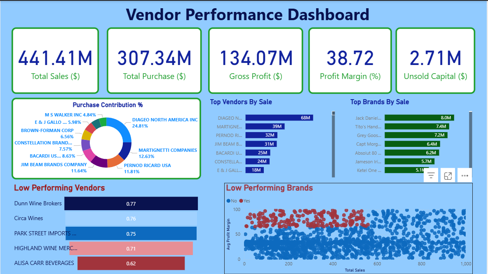

# 📊 Vendor Performance Analysis & Dashboard

> End-to-End Data Analytics Project  
> Python | Pandas | Power BI | Business KPI Analysis

---

## 🔎 Executive Summary

This project evaluates vendor sales and profitability performance using Python for data processing and Power BI for interactive dashboard visualization.

The objective was to analyze financial KPIs, identify high- and low-performing vendors, and generate actionable business insights.

The final output includes:
- Structured data transformation pipeline
- KPI computation
- Exploratory Data Analysis (EDA)
- Interactive Power BI dashboard

---

---

## 📁 Dataset Information

The original dataset used for analysis contained a larger volume of transactional records.

Due to GitHub file size limitations, a smaller sample dataset has been uploaded in this repository for demonstration purposes.

The sample dataset:
- Preserves the original schema and structure
- Contains representative vendor and brand records
- Allows full reproducibility of KPI calculations and dashboard logic

All analysis logic, KPI computation, and dashboard metrics were originally validated on the complete dataset.

---

## 🎯 Business Problem

Organizations need visibility into:

- Which vendors generate the most revenue
- Which vendors operate at low profit margins
- Where capital is locked in unsold inventory
- Brand-level contribution to overall performance

This project provides a data-driven evaluation framework to support vendor decision-making.

---

## 📊 Dashboard Preview

---

## 📈 Key Performance Indicators (KPIs)

| Metric | Value |
|--------|--------|
| **Total Sales** | $441.41M |
| **Total Purchases** | $307.34M |
| **Gross Profit** | $134.07M |
| **Profit Margin** | 38.72% |
| **Unsold Capital** | $2.71M |

---

## 📊 Dashboard Breakdown

### 1️⃣ KPI Cards
High-level financial metrics providing executive overview.

### 2️⃣ Purchase Contribution %
Donut chart displaying vendor revenue contribution.

**Insight:** Revenue concentration follows a Pareto pattern — a few vendors dominate total sales.

### 3️⃣ Top Vendors by Sales
Bar chart ranking vendors by total sales.

### 4️⃣ Top Brands by Sales
Brand-level performance comparison.

### 5️⃣ Low Performing Vendors
Identifies vendors with lower performance scores.

### 6️⃣ Low Performing Brands (Sales vs Profit Margin Scatter Plot)
Used to detect:
- High Sales, Low Margin brands
- Low Sales, Low Margin brands
- Optimization opportunities

---

## 🧠 Key Business Insights

- Revenue is highly concentrated among a small number of vendors.
- Some high-revenue vendors operate on relatively lower profit margins.
- Inventory inefficiencies create measurable unsold capital.
- Brand-level profitability varies significantly.
- Vendor ranking can guide strategic supplier negotiations.

---

## 🛠 Technical Workflow

### Data Processing (Python)

- Data cleaning and preprocessing
- Missing value handling
- KPI computation
- Vendor aggregation
- Profit margin calculation
- Ranking logic implementation

### Tools Used

- Python
- Pandas
- NumPy
- Matplotlib / Seaborn
- Power BI
- Jupyter Notebook

---

## 📂 Project Structure

---

## ⚙ How to Run This Project

### 1️⃣ Clone Repository

### 2️⃣ Install Dependencies

### 3️⃣ Run Jupyter Notebooks

Open:
- `Exploratory Data Analysis.ipynb`
- `Vendor Performance Analysis.ipynb`

### 4️⃣ Open Power BI Dashboard

Open `Vendor_Performance_Dashboard.pbix` in Power BI Desktop.

---

## 💼 Skills Demonstrated

- Data Cleaning & Preprocessing
- Financial KPI Development
- Business Analytics
- Vendor Performance Evaluation
- Data Visualization
- Dashboard Design
- Analytical Thinking
- Insight Communication

---

## 🚀 Potential Enhancements

- SQL database integration
- Automated ETL pipeline
- Vendor clustering analysis
- Predictive modeling for sales forecasting

---

## 👤 Author

Eklovya Sharma  
Aspiring Data Analyst  
 
🔗 GitHub: [Eklovya195](https://github.com/Eklovya195)

---

## ⭐ Project Value

This project demonstrates the ability to:

- Convert raw transactional data into structured insights
- Perform end-to-end analytics workflows
- Build executive-level dashboards
- Communicate financial metrics clearly

